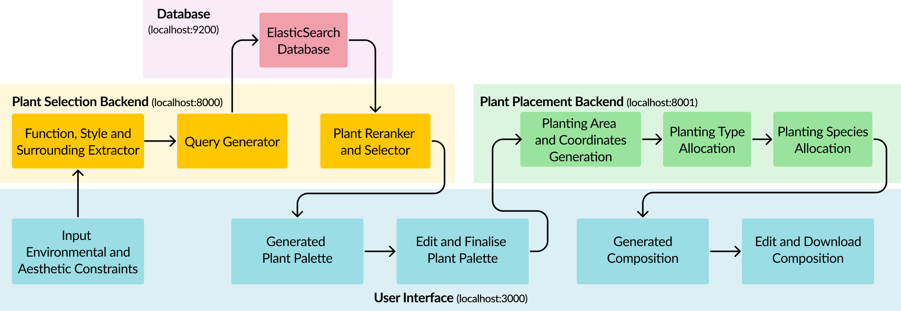

# Dreamscape
This is the GitHub Repository for Dreamscape, a generative planting composition software. <br> Dreamscape is a collaboration between Design and Artificial Students (DAI) from the Singapore University of Technology and Design and the Housing Development Board of Singapore under 60.006 Spatial Design Studio. 

Project Report: https://drive.google.com/file/d/1HDlCq3xDOpB0-PVAmdA2Zf6z42MEYVcn/view?usp=drive_link

## System design of Dreamscape


Dreamscape is made out of 4 key components:
1. ElasticSearch Database
2. Plant Selection Backend
3. Plant Placement (Spatial Placement) Backend
4. User Interface

Every microservice has been dockerised. This README folder will explain how to initialise each docker containers. <br>
To understand more of each microservice, please read the individual READMEs in each folder.

# Intialisation
## .env file in build/ and hdb-ui/
Before you intialise each microservice, you will need to create a .env file in the build folder. <br>
An **.env.template** with the default values has been provided, please create a **.env** file and duplicate the variables in the .env.template <br>

Note: If you modified the `AI_SPATIAL_SERVICE_PORT` and `AI_PLANT_SERVICE_PORT`, please head to hdb-ui/.env and update the ports accordingly.

You will require an **OpenAI API key** to continue with this project. <br>
If you intend to use our dataset preprocessing code for ElasticSearch, a **HuggingFace API key to an account with LLama2-7b access** will also be required. <br>
Please fill in the respective API keys into your .env file before proceeding with intialising each microservice.

## Initialisation of microservices
To intialise each microservice, run the following function in your terminal.
```
cd build
docker compose up
```
Every microservice will automatically startup with their respective commands except for Kibana.

## Resolving Kibana
In order to ensure that Kibana microservice works, please do the following:<br><br>
a. You are using **Docker Desktop**.<br>
Enter the <b>elasticsearch</b> container, head to the **exec** tab and run the following
```
bash
./bin/elasticsearch-reset-password --username kibana_system -i 
<enter the kibana_system Password which corresponds to ELASTIC_PASSWORD in your .env file>
```
b. If you are using the **terminal** (command prompt, power shell, etc).<br>
Run the following to retrieve the elasticsearch container id.
```
sudo docker ps -aqf "name=elasticsearch"
```
Afterwards, run the following command:
```
docker exec -it <elastic container id> bash
./bin/elasticsearch-reset-password --username kibana_system -i 
<enter the kibana_system Password which corresponds to ELASTIC_PASSWORD in your .env file>
```
After running either of the commands in Docker Desktop or in the terminal, <br> 
restart the kibana container and go to `http://localhost:${KIBANA_SERVICE_PORT}` where `${KIBANA_SERVICE_PORT}` is the value in your .env file.
<br></br>
If you can login to the Kibana UI with the following:<br>
```
username: elastic
password: ELASTIC_PASSWORD in your .env file
```
you have successfully setup all microservices in docker.

# Accessing Dreamscape
To access dreamscape, go to `http://localhost:${UI_SERVICE_PORT}` where `${UI_SERVICE_PORT}` is the value in your .env file.<br>
The default value would be `http://localhost:3000`

# Microservice Details
To understand more about each microservice, please look into the READMEs in each folder.

