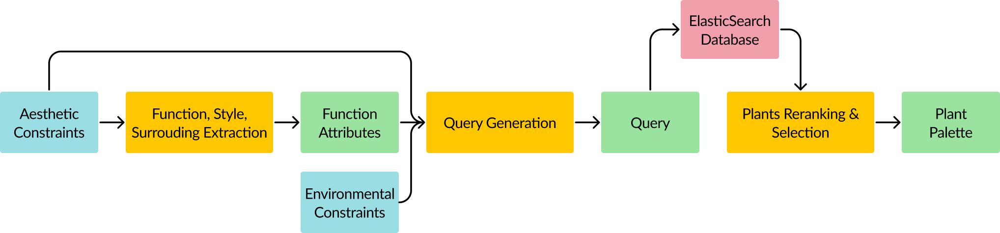

# HDB-Plant-Selection

This is the folder containing the Plant Selection Backend for Dreamscape. This backend is built in python with a FastAPI framework.

# System Design


# Docker Requirements
Plant Selection requires 1 main container to be running:
```
ElasticSearch DB service
```
Ensure that the database is running in the same docker network as the Plant Selection container.<br>

If you receive any docker errors mentioning that the application cannot start due to connection error, this is because your elasticsearch container has not fully started. <br>
Simply wait for a while before restarting the container to resolve any errors.

# Tests
All tests files are in the tests folder. To run the test file, head to your docker terminal (make sure the service is running) and enter the following commands:
```
cd hdb-plant-selection (ensure you are in this directory)
python tests/test.py
```
If the file ran without any error, the backend is functioning.

# File structure
This section will explain the file structure of the current React file as well as a quick explanation of how should you structure / edit the files if required.

```
├── notebooks                      <- cleaned notebooks if you prefer them over python files
│ 
├── src                            <- base folder containing all the main code for each service
│   ├── input                      <- folder containing schema for GPT-4o response
│   │
│   ├── utils                      <- folder containing files needed for the microservice
│   │
│   └── main.py                    <- main python file that consist of all the endpoints for the fastAPI
│
├── tests                          <- folder containing all test files required for each microservice
│   └── test.py                    <- python file containing test code to test endpoint
|
└── requirements.txt               <- text file containing required python packages

```

# Deployment Outside of Docker
If you intend to run the microservice outside of docker (assuming all your microservices are also outside of docker), the following needs to be done:
1. Head to src/main.py and uncomment os.environ['ELASTIC_PASSWORD']
2. Fill in the value with your elasticsearch password (default is either changeme / elasticpw)
3. Modify `os.environ['ELASTIC_HOST'] = 'elasticsearch'` to `os.environ['ELASTIC_HOST'] = 'localhost'`
4. Modify `os.environ['ELASTIC_PORT'] = os.environ['ELASTIC_HOST_PORT']` to `os.environ['ELASTIC_PORT'] = <the port elasticsearch is hosted on (default 9200)>`

Afterwhich, you may run the following in your terminal:
```
cd hdb-spatial-placement
uvicorn src.main:app --reload --host=<your host> --port=<your port>
```
An example would be the following:
```
cd hdb-spatial-placement
uvicorn src.main:app --reload --host=0.0.0.0 --port=8000
```
You may go to `http://localhost:8000` to confirm the microservice is running.
