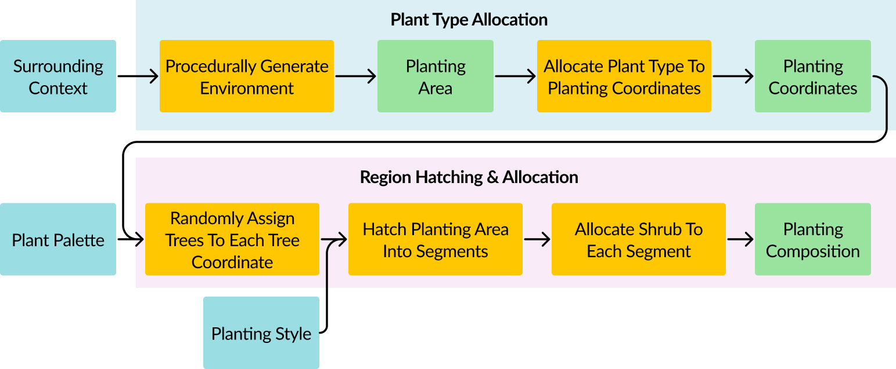

# HDB-Spatial-Placement

This is the folder containing the Spatial Placement Backend for Dreamscape. This backend is built in python with a FastAPI framework.

# System Design


# Train RL model
The Spatial Placement Backend relies on an Reinforcement Learning (RL) model for Plant Type Allocation. <br>
The ability to train your own RL model is available.

The following arguments are provided for your RL training:
```
--num_step (int): Determines number of steps before policy update in training, defaults to 10
--num_env (int): Determines number of environments to use in training, defaults to 50
--num_run (int): Determines number of policy updates to run in training, defaults to 10000
--model_name (str): Determines the name of the zip file the model will save in src/models, defaults to plantTypeAllocationModel.zip
```
To train your RL model with default parameters, run the following:
```
cd hdb-spatial-placement (ensure you are in this directory)
python -m src.train 
```

# Evalulate RL model
The ability to evaluate your own RL model is also available.
The following arguments are provided for your RL evaluation:
```
--model_name (str): Determines the name of the zip file the model will save in src/models, defaults to plantTypeAllocationModel.zip
--model_folder (str): Determines the src folder of your model containing the zip file, defaults to ./src/models/
--environment_octave (float): Determines the octave of the evaluation environment, defaults to None (randomly generate environment)
--environment_seed (int): Determines the seed of the evaluation environment, defaults to None (randomly generate environment)
--environment_context (int): Determines the environmental of the evaluation environment, defaults to 0 (Road)
```
To eval your RL model with default parameters, run the following:
```
cd hdb-spatial-placement (ensure you are in this directory)
python -m src.eval 
```

# Tests
All tests files are in the tests folder. To run the test file, head to your docker terminal (make sure the service is running) and enter the following commands:
```
cd hdb-spatial-placement (ensure you are in this directory)
python tests/test.py
```
If the file ran without any error, the backend is functioning.

# File structure
This section will explain the file structure of the current React file as well as a quick explanation of how should you structure / edit the files if required.

```
├── notebooks                      <- cleaned notebooks if you prefer them over python files
│ 
├── src                            <- base folder containing all the main code for each service
│   ├── models                     <- folder containing trained RL models
│   │
│   ├── utils                      <- folder containing any utils file needed (eg. model code, environment code)
│   │
│   ├── train.py                   <- python file to train RL model
│   │
│   ├── eval.py                    <- python file to evaluate RL model
│   │
│   └── main.py                    <- main python file that consist of all the endpoints for the fastAPI
│
├── tests                          <- folder containing all test files required for each microservice
│   └── test.py                    <- python file containing test code to test endpoint
|
└── requirements.txt               <- text file containing required python packages

```

# Deployment Outside of Docker
If you intend to run the microservice outside of docker (assuming all your microservices are also outside of docker), you may run the following code in your directory terminal:
```
cd hdb-spatial-placement
uvicorn src.main:app --reload --host=<your host> --port=<your port>
```
An example would be the following:
```
cd hdb-spatial-placement
uvicorn src.main:app --reload --host=0.0.0.0 --port=8001
```
You may go to `http://localhost:8001` to confirm the microservice is running.
